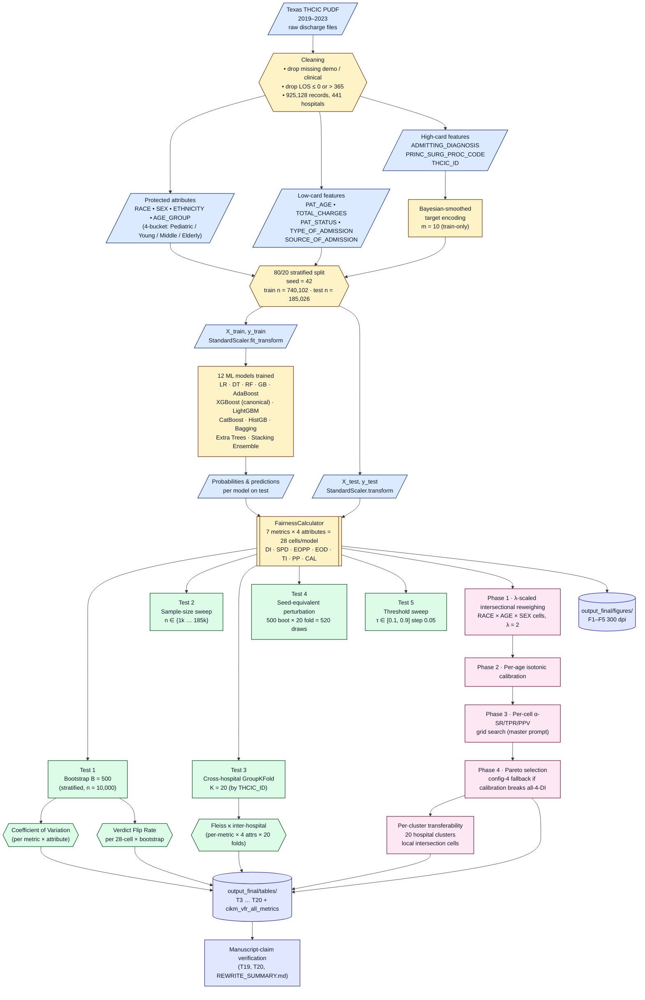
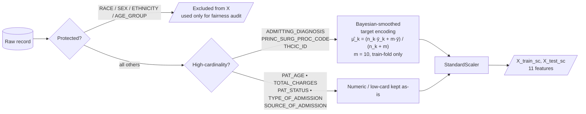
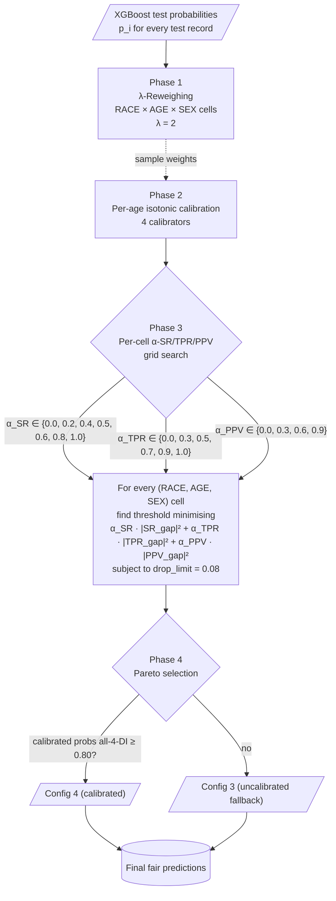
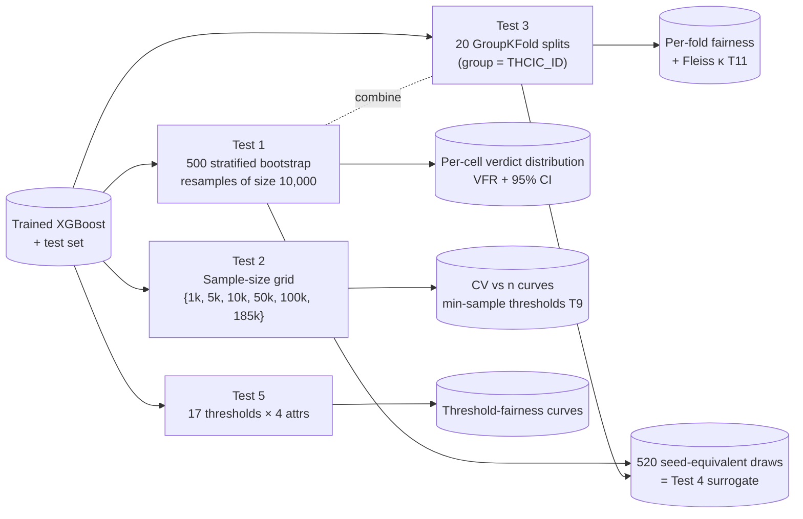

# Pipeline Diagram — CIKM 2026 LOS Fairness

End-to-end pipeline of the FINAL notebook
(`CIKM_2026_LOS_Fairness_FINAL.ipynb`).
Renders in any Markdown viewer that supports Mermaid (GitHub, Overleaf
via `mermaid` package, VS Code with mermaid extension, JupyterLab,
Notion, Obsidian).

---

## 1. High-level pipeline (poster-style)



---

## 2. Detailed: feature pipeline only



---

## 3. Detailed: intervention pipeline only



---

## 4. Stability-test layer — data flow



---

## How to render in your manuscript / IDE

* **VS Code**: install the *Markdown Preview Mermaid Support* extension, open this file, press `Ctrl+Shift+V`.
* **GitHub README**: paste the ` ```mermaid … ``` ` block — renders natively.
* **Overleaf / LaTeX**: convert to PNG/SVG with [mermaid-cli](https://github.com/mermaid-js/mermaid-cli):
  ```bash
  npx -p @mermaid-js/mermaid-cli mmdc -i PIPELINE_DIAGRAM.md -o PIPELINE_DIAGRAM.png -t default -b transparent
  ```
* **JupyterLab**: install `jupyterlab-mermaid` and render Markdown cells with `mermaid` fences.
